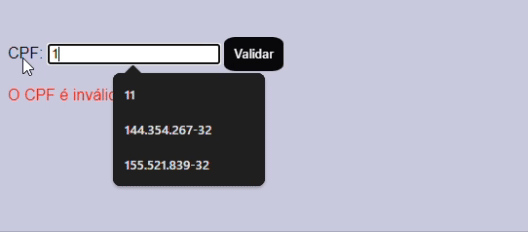

# Validações em JavaScript 

# Introdução 

#### Desenvolver uma aplicação web simples utilizando JavaScript para validar a formatação e a integridade de números de CPF e endereços de email inseridos pelo usuário. 
#### Também Definir detalhadamente as regras de validação para CPF e email, considerando os padrões de formato de email, Essas regras para validação será apresentadas futuramente nos capítulos deste arquivo README.

# Desenvolvimento 

#### Mensagens de erro personalizadas: Exibe mensagens claras e concisas para cada tipo de erro, facilitando a compreensão do usuário.
#### O código desenvolvido pode ser adaptado e reutilizado em outros projetos, agilizando o desenvolvimento.

# Recursos JS utilizados no projeto ChecarEmail

#### Função validarCPF(cpf) 

#### Descrição: Função que valida um número de CPF para garantir que ele seja válido conforme as regras brasileiras.

### Função:

 - Remove caracteres não numéricos do CPF usando uma expressão regular (cpf.replace(/[^\d]+/g, '')). 
 - Verifica o comprimento e a uniformidade dos dígitos do CPF (se todos são iguais) para garantir que não seja um CPF inválido.
 - Valida o primeiro dígito verificador:
 - Calcula a soma dos produtos dos 9 primeiros dígitos por pesos decrescentes de 10 a 2.
 - Determina o resto da divisão da soma multiplicada por 10 por 11.
 - Compara o valor obtido com o primeiro dígito verificador do CPF.
 - Valida o segundo dígito verificador:
 - Calcula a soma dos produtos dos 10 primeiros dígitos por pesos decrescentes de 11 a 2.
 - Determina o resto da divisão da soma multiplicada por 10 por 11.
 - Compara o valor obtido com o segundo dígito verificador do CPF.
 - Retorna true se ambos os dígitos verificadores são válidos; caso contrário, retorna false.

# Conclusão

#### O código JavaScript adiciona uma validação interativa ao formulário de CPF, verificando se o CPF inserido é válido e exibindo uma mensagem apropriada. A função validarCPF realiza a lógica principal para verificar a conformidade do CPF com as regras oficiais, enquanto o escutador de evento no formulário lida com a interface e o feedback ao usuário.

